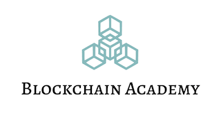

<h1>Курс по блокчейн разработке</h1>

<em>Освоите принципы блокчейн-разработки и получите навыки для работы в этом направлении</em>

<strong>Для кого:&nbsp;</strong>

<li style="font-weight: 400;" aria-level="1">Формат:&nbsp;</strong>

<li style="font-weight: 400;" aria-level="1">80% практика / ревью заданий / Q&amp;A, 20% видео преподавателя 

<h2><strong>Примерная программа:</strong></h2>
<strong>Основы блокчейна&nbsp;</strong>

<ul>
<li style="font-weight: 400;" aria-level="1">Свойства, состояния, транзакции, блоки. Доверие к участникам сети</li>
<li style="font-weight: 400;" aria-level="1">Практическое занятие. Работа с GPG: создание пары ключей, подпись, шифрование. Подключение к тестнету BTC, создание кошелька, работа с эксплорером. Работа с тестнетом Ethereum</li>
</ul>

<strong>Развертывание рабочего окружения&nbsp;</strong>

<ol>
<li style="font-weight: 400;" aria-level="1">Установка Visual Studio Code</li>
<li style="font-weight: 400;" aria-level="1">Установка расширения Visual Studio Code для работы с Solidity</li>
<li style="font-weight: 400;" aria-level="1">Установка транслятора Nodejs</li>
<li style="font-weight: 400;" aria-level="1">Тестирование Nodejs и подключение Фреймворка Truffle</li>
<li style="font-weight: 400;" aria-level="1">Установка эмулятора Ganache</li>
<li style="font-weight: 400;" aria-level="1">Подключение тестового проекта к Ganache и проверка его работы</li>
<li style="font-weight: 400;" aria-level="1">Установка плагина MetaMask для работы с крипто кошельками</li>
<li style="font-weight: 400;" aria-level="1">Установка оффлайн криптокошелька MyEtherWallet</li>
</ol>

<strong>Создание смарт-контракта&nbsp;</strong>

<ol>
<li style="font-weight: 400;" aria-level="1">Структура проекта Solidity в VS Code</li>
<li style="font-weight: 400;" aria-level="1">Создание нового проекта Solidity</li>
<li style="font-weight: 400;" aria-level="1">Создаем наш первый смарт-контракт &laquo;Hello World!!!&raquo;</li>
<li style="font-weight: 400;" aria-level="1">Публикация смарт-контракта HelloWorld в эмуляторе Ganache</li>
<li style="font-weight: 400;" aria-level="1">Запуск нового смарт-контракта HelloWorld</li>
<li style="font-weight: 400;" aria-level="1">Смарт-контракт Factorial</li>
<li style="font-weight: 400;" aria-level="1">Смарт-контракт Calculator</li>
</ol>

<strong>Хранение и обработка данных&nbsp;</strong>

<ol>
<li style="font-weight: 400;" aria-level="1">Простейший смарт-контракт для хранения данных &laquo;Note&raquo;</li>
<li style="font-weight: 400;" aria-level="1">Смарт-контракт с поиском данных &laquo;NewNote&raquo;</li>
<li style="font-weight: 400;" aria-level="1">Смарт-контракт с ограниченным доступом &laquo;Owner&raquo;</li>
<li style="font-weight: 400;" aria-level="1">Смарт-контракт с подсчетом статистики &laquo;Grades&raquo;</li>
<li style="font-weight: 400;" aria-level="1">Смарт-контракт по обработке массивов &laquo;Address&raquo;</li>
<li style="font-weight: 400;" aria-level="1">Смарт-контракт для голосования &laquo;Voter&raquo;</li>
<li style="font-weight: 400;" aria-level="1">Контрольное задание</li>
</ol>

<strong>Финансовые смарт-контракты&nbsp;</strong>

<ol>
<li style="font-weight: 400;" aria-level="1">Смарт-контракт для перевода средств &laquo;Transaction&raquo;</li>
<li style="font-weight: 400;" aria-level="1">Смарт-контракт для раздельного перевода средств &laquo;Split&raquo;</li>
<li style="font-weight: 400;" aria-level="1">Смарт-контракт для сбора пожертвований &laquo;Donation&raquo;</li>
<li style="font-weight: 400;" aria-level="1">Смарт-контракт реализации банковского депозита &laquo;BankDeposit&raquo;</li>
<li style="font-weight: 400;" aria-level="1">Смарт-контракт медицинского страхования &laquo;Insurance&raquo;</li>
<li style="font-weight: 400;" aria-level="1">Создание своего собственного токена &laquo;MyCoin&raquo;</li>
<li style="font-weight: 400;" aria-level="1">Контрольное задание</li>
</ol>

<strong>Интерфейс, тестирование и публикация смарт-контрактов&nbsp;</strong>

<ol>
<li style="font-weight: 400;" aria-level="1">Тестирование смарт-контрактов</li>
<li style="font-weight: 400;" aria-level="1">Простейшее децентрализованное приложение &laquo;Greetings&raquo;</li>
<li style="font-weight: 400;" aria-level="1">Децентрализованное приложение для голосования &laquo;VotingDapp&raquo;</li>
<li style="font-weight: 400;" aria-level="1">Публикация и запуск смарт-контракта в тестовой блокчейн-сети</li>
<li style="font-weight: 400;" aria-level="1">Создание собственной блокчейн-сети на Ethereum</li>
<li style="font-weight: 400;" aria-level="1">Публичные блокчейн-сети</li>
<li style="font-weight: 400;" aria-level="1">Контрольное задание</li>
</ol>

<strong>Основы создания dApps на React&nbsp;</strong>

<ol>
<li style="font-weight: 400;" aria-level="1">Знакомство с React</li>
<li style="font-weight: 400;" aria-level="1">Web 3js</li>
<li style="font-weight: 400;" aria-level="1">Создание финансовых dApps</li>
</ol>
<ul>
<li aria-level="1"><strong>L2 протоколы и шардинг</strong></li>
</ul>
<h1 style="color: #5e9ca0;">&nbsp;</h1>

